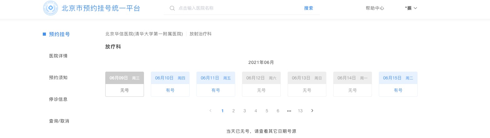
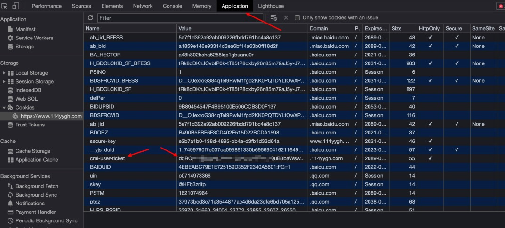
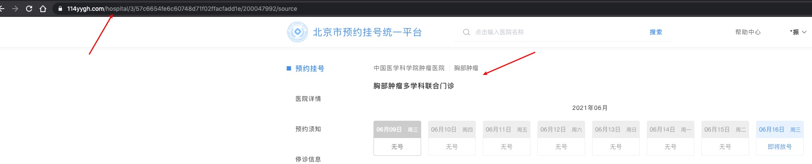
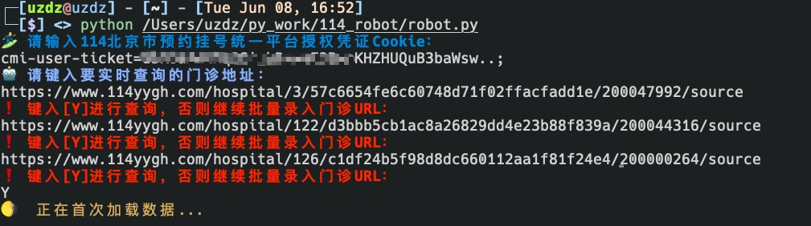
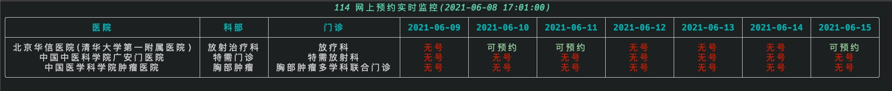

# 114预约挂号平台实时刷新工具

#### 1. 自主登陆114获取cookie信息

* 114网址：https://www.114yygh.com/

登陆到114之后，自主进行授权操作，登陆后，点击F12进入开发者工具。

找到Application选项卡，然后找到cookie为`cmi-user-ticket`的cookie，将Key和Value通过等于号(=)拼装起来拼。运行程序第一步键入该值！

#### 2. 选择要实时检测的门诊网址

选择自己希望查询的门诊科室，然后复制URL即可，例如：

* https://www.114yygh.com/hospital/126/c1df24b5f98d8dc660112aa1f81f24e4/200000264/source
* https://www.114yygh.com/hospital/122/d3bbb5cb1ac8a26829dd4e23b88f839a/200044316/source
* https://www.114yygh.com/hospital/3/57c6654fe6c60748d71f02ffacfadd1e/200047992/source

必须点击到最细的科室级别，然后复制URL，否则无发进行解析。

#### 3. 运行py文件

#### 4. 实时查看门诊预约状态（每30秒查询一次）

## 请不要加快查询速度，防止对114服务造成请求压力，维护计算机安全。