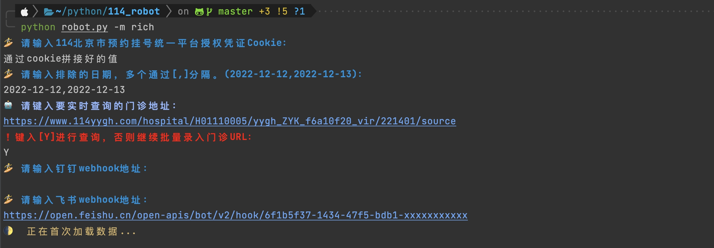

# 北京114预约挂号平台实时刷新工具

### 1. 自主登陆114获取cookie信息

* 114网址：https://www.114yygh.com/

登陆到114之后，自主进行授权操作，登陆后，点击F12进入开发者工具。

找到Application选项卡，然后找到cookie为`cmi-user-ticket`的`cookie`，将`Key`和`Value`通过等于号(`=`)拼装起来拼，用于后续操作赋值。

### 2. 选择要实时检测的门诊网址

选择自己希望查询的门诊科室，然后复制URL即可，例如：

* https://www.114yygh.com/hospital/126/c1df24b5f98d8dc660112aa1f81f24e4/200000264/source
* https://www.114yygh.com/hospital/122/d3bbb5cb1ac8a26829dd4e23b88f839a/200044316/source
* https://www.114yygh.com/hospital/3/57c6654fe6c60748d71f02ffacfadd1e/200047992/source

必须点击到最细的科室级别，然后复制URL，否则无发进行解析。

### 3. 运行py文件

目前分为两种运行模式，用于不同场景：

* (默认) default：静默
* rich：Terminal 高亮

#### 3.1 default 静默模式

#### 3.2 rich 高亮模式

### 4. 实时门诊预约状态

### 5. 渠道通知

通过录入钉钉、飞书webhook地址，程序自动发送有号通知提醒。

# 免责声明

此软件程序用于替代人工耗时的检索过程，请勿修改代码中的网站保护策略。知法懂法，请参考[破坏计算机信息系统罪](https://www.66law.cn/zuiming/276.aspx)。
